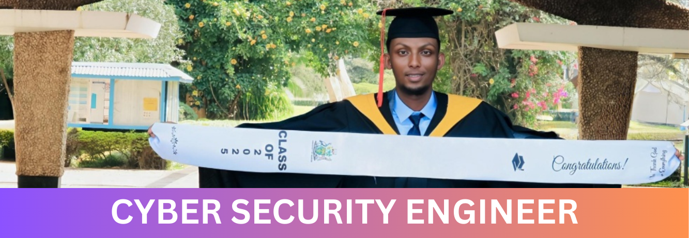

  

  # Abdiladif Hassan Adan
  ### 🛡️ Cyber Security Engineer | AppSec | Cloud Security Architect | DevSecOps
  

    
    
  

  
   

    
    
  

---

## 🎯 Executive Summary

As an ISC2-Certified Cybersecurity Professional and a First Class Honours graduate in Computer Science from the University of Nairobi, I bring a rare combination of verified security fundamentals and elite technical aptitude. With specialized expertise in Application security, Cloud Security Architect, DevSecOps, and Computer Network Security, I am equipped to immediately contribute to your security operations and help fortify your organization's digital assets. 

---

## 📜 Certifications & Core Competencies

* 🏆 <a href="https://www.credly.com/badges/0eefa886-6aae-46fb-819d-2aa6435b516a/public_url">**ISC2 Certified in Cybersecurity (CC)**</a> - Validated expertise in Access Controls, Network Security, Security Operations, Incident Response, and Disaster Recovery (DR).
* 🎓 **BSc Computer Science (First Class Honours)** - University of Nairobi (GPA: 3.68/4.00). Advanced coursework in Distributed Databases and Cloud Computing.

---

## ⚔️ Security Engineering Arsenal

### Offensive Security (Red Team) & Vulnerability Assessment

  
  
  
  
  

### Defensive Security (Blue Team) & Network Security

  
  
  
  

### Security Engineering & Scripting

  
  
  
  
  

### Security Architecture & DevSecOps

  
  
  
  
  

### Application Security (AppSec) & Scripting

  
  
  
  

## 📊 Security Metrics & Code Contribution

## 📊 My GitHub Stats

  
  

